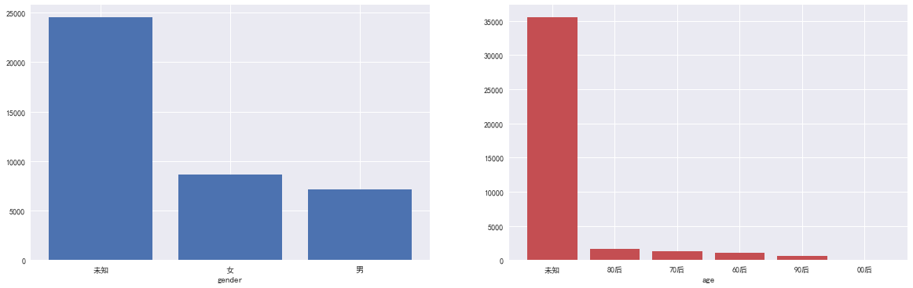
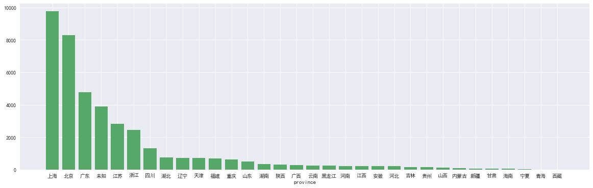
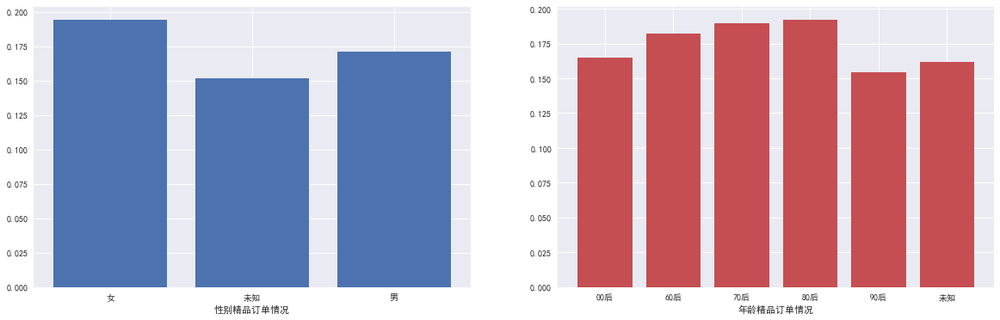
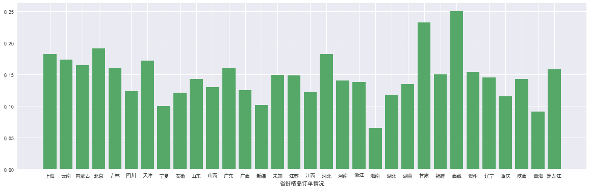

# 精品旅行成单预测 


## 1 案例背景

### 1.1 背景说明

皇包车（HI GUIDES）是一家为中国==出境游==客户提供定制化服务的平台。拥有境外万名华人司机兼导游（司导），覆盖全球多个国家，多个城市，多个国际机场。截至年月，已累计服务万中国出境游客户。
由于消费者消费能力逐渐增强、旅游信息不透明程度的下降，游客的行为逐渐变得难以预测，传统旅行社的旅游路线模式已经不能满足游客需求。而对于企业来说，传统旅游线路对其营业利润的贡献也越来越有限，公司希望通过提升服务品质，通过附加值更高的==精品服务==来改变目前遇到的困境。为此该企业除了提供普通的旅行服务，也提出了相对更高品质的精品旅行服务。

| 思考                                                         |
| ------------------------------------------------------------ |
| 精品服务，是否是客户心中的精品服务？ <br>客户是否会为精品服务买单？ |

回答这些问题的首要步骤是去找到哪些客户会选择这些精品服务。也只有了解了这个问题的答案，才能对 精
品服务的发展更深入地了解和优化。

于是，本案例的主题便是精品旅行成单预测，即希望通过分析客户的行为，了解不同的客户，对他们下一次服务的品质是否是精品服务进行预测。

### 1.2 什么是成单预测

成单是商业定货时所签订的契约，是一个买卖双方进行交易的重要凭证。

成单预测是客户关系管理中的一个部分，指在交易双方还未进行互动前，对双方是否能达成交易进行的预测。其主要的工作原理是，根据过去某项产品的数据资料的状况，推估其现在状况。传统的成单预测主要是着眼于一个或者几个相对较少的指标进行检定预测，由于指标相对较少，所得结果的效果好坏与指定的指标好坏具有很大的关联，因此相当考验预测者对于指标的敏感度，且传统的预测方式所使用的数据资料数量有限，预测的精确程度也相对不稳定。

相比较于传统的成单预测，基于大数据分析的成单预测更具有优势。首先通过大数据分析的方法， 我们可以选择大量的指标，将所有指标纳入一个体系中进行分析，相对于原本的逐个指标检定更具有效率，也能在分析时自动调整指标的重要程度，节省时间。当然，在这里人为地选择指标，依旧也是一种提高分析效果与效率的好方法。其次，我们同样也知道，预测分析结果的好坏与预测前我们我们分析的过去资料的资料量有一定的关系。一般来说，训练资料的量越大， 分析的效果越好，分析结果越准确。而恰恰大数据分析可以分析大量的资料，只要硬件能力也好，分析的量越大，速度越快。特别是随着大数据时代的到来，使这一优势更为明显。

通过成单预测，我们可以更精确地预估某项产品的交易状况。让公司了解其客户，了解哪些客户是优质客户，哪些客户是潜在客户等，进行客户分群，进而完成用户画像的动作。同时也可以通过对比实际与预测的结果，分析是否要对于产品进行调整，帮助公司决策者进行辅助决策。
当然，运用大数据分析的方式进行成单预测，最为重要的两点原因就是： 

1.  无论是人力成本增加还是其他红利的流失的压力，公司都越来越关注效率，而大数据分析是效率瓶颈的重要工具。
2.  过去公司信息系统主要关注在自己公司内部系统之间信息孤岛的连通。但随着开放平台的发展，会有越来越多的公司内部系统与外部数据交互结合的情况，这些资料的交互会变得更为复杂，更加需要进行大数据分析，理顺其中的关系 

### 1.3 了解客户价值分析 

客户营销战略倡导者Jay&Adam Curry 从国外数百家公司的客户营销实施的经验中提炼了如下经验：

- 公司收入的80%来自顶端的20%客户

- 20%的客户其利润率100%

- 90%以上的收入来自现有客户

- 大部分的营销预算经常被用在非现有客户上

- 5%至30%的客户在客户金字塔中具有升级潜力

- 客户金字塔中客户升级2%，意味着销售收入增加10%，利润增加50%

    经验也许并不完全正确，但是它揭示了新时代客户分化的趋势，也说明了对客户价值分析的迫切性和必要性。
    客户行为分析的关键特征


### 1.4 客户行为分析的关键特征 

| 维度                                                         |
| ------------------------------------------------------------ |
| 对客户进行多维度地分析，以用户的地域、性别、年龄等人文属性建立分析维度，然后进行筛选，这样可以简单 地把模型的相关性大幅提高。 |
| 页面浏览量                                                   |
| PageView，即 PV，指用户向网站发出并完成的一个下载页面的请求，即页面被用户浏览的次数。 页面浏览的 概念主要适用于网页端产品，对于 App 的分析，现主要使用屏幕浏览，即 ScreenView。 |
| 跳出率                                                       |
| BounceRate，一个衡量落地页质量好坏的重要指标。跳出的概念是指用户在一次访问中仅做了一次互动便选择 了离开，单一页面和全站均有跳出率的概念。 页面跳出率的计算为该页面作为落地页跳出的访问次数占该页面 作为落地页访问次数的占比。全站跳出率则为跳出的访问次数除以总的访问次数。 |
| 停留时长                                                     |
| 对应于用户 Session，便有了停留时长指标，主要用来衡量用户与网站、App 交互的深度。交互越深，相应停留 的时长也越长。一般有页面停留时长，会话时长以及平均停留时长等概念，其计算的核心原理在于记录下用户行 为发生时的时间戳，然后再应用相应公式来计算。 |
| 转化率                                                       |
| 任何产品都需要关注的核心指标，主要用来衡量用户从流量到发生实际目标转化的能力。 一般用目标转化的次 数或人数除以进入目标转化漏斗的人数或次数，因目标行为的不同，转化率是一个非常灵活的指标，比如你可以 自定义注册转化率、登录转化率、购买转化率、搜索成功转化率等。 |


## 2. 数据预处理及特征工程 

| 注意                                                         |
| ------------------------------------------------------------ |
| 并非每一位用户都有非常完整的记录，如有用户并没有订单记录，有些用户却没有行为轨迹记录。 同时需要注 意的是数据做过脱敏处理： （1）隐藏了用户的ID信息； （2）将用户属性信息全部数字化； （3）将时间戳和 所有金额的值都做了函数变换。 |


### 数据详细描述：

  **(a)用户个人信息：userProfile_\**\*.csv**  （***表示train或者test，下同）

数据共有四列，分别是用户id、性别、省份、年龄段。注：信息会有缺失。

例如： userid,gender,province,age 

​           100000000127,,上海, 

​           100000000231,男,北京,70后 


  **(b)用户行为信息：action_\**\*.csv** 

数据共有三列，分别是用户id，行为类型，发生时间。

例如： userid,actionType,actionTime 

​           100000000111,1,1490971433 

​           100000000111,5,1490971446 

​           100000000111,6,1490971479 

​           100000000127,1,1490695669 

​           100000000127,5,1490695821 

行为类型一共有9个，其中1是唤醒app；2~4是浏览产品，无先后关系；5~9则是有先后关系的，从填写表单到提交订单再到最后支付。

注意：数据存在一定的缺失！


  **(c)用户历史订单数据：orderHistory_\**\*.csv** 

该数据描述了用户的历史订单信息。数据共有7列，分别是用户id，订单id，订单时间，订单类型，旅游城市，国家，大陆。==其中1表示购买了精品旅游服务，0表示普通旅游服务。==

例如： userid,orderid,orderTime,orderType,city,country,continent 

​           100000000371, 1000709,1503443585,0,东京,日本,亚洲 

​           100000000393, 1000952,1499440296,0,巴黎,法国,欧洲

注意：一个用户可能会有多个订单，需要预测的是用户最近一次订单的类型；此文件给到的订单记录都是在“被预测订单”之前的记录信息！同一时刻可能有多个订单，属于父订单和子订单的关系。


```
RangeIndex: 20653 entries, 0 to 20652
Data columns (total 7 columns):
userid       20653 non-null int64
orderid      20653 non-null int64
orderTime    20653 non-null int64
orderType    20653 non-null int64
city         20653 non-null object
country      20653 non-null object
continent    20653 non-null object
dtypes: int64(4), object(3)
memory usage: 1.1+ MB

不同的user为 10637
```


  **(d)待预测订单的数据：orderFuture_\**\*.csv** 

对于train，有两列，分别是用户id和订单类型。供参赛者训练模型使用。其中1表示购买了精品旅游服务，0表示未购买精品旅游服务（包括普通旅游服务和未下订单）。

例如： userid,orderType 

​           102040050111,0 

​           103020010127,1 

​           100002030231,0 

对于test，只有一列用户id，是待预测的用户列表。


  **(e)评论数据：userComment_\**\*.csv** 

共有5个字段，分别是用户id，订单id，评分，标签，评论内容。

其中受数据保密性约束，评论内容仅显示一些关键词。 

​          userid,orderid,rating,tags,commentsKeyWords 

​          100000550471, 1001899,5.0,, 

​          10044000637, 1001930,5.0,主动热情|提前联系|景点介绍详尽|耐心等候, 

​          111333446057, 1001960,5.0,主动热情|耐心等候,['平稳', '很好']

```
只有9863条数据  而user有40307
<class 'pandas.core.frame.DataFrame'>
RangeIndex: 9863 entries, 0 to 9862
Data columns (total 5 columns):
userid              9863 non-null int64
orderid             9863 non-null int64
rating              9863 non-null float64
tags                6754 non-null object
commentsKeyWords    4092 non-null object
dtypes: float64(1), int64(2), object(2)
memory usage: 385.4+ KB
```


### 2.1 待预测订单数据分析处理
在正式进行操作之前，我们可以先看一下table_0这张数据表，包含了哪些数据 

| 中文名   | 存储名    | 范例         | 有效值率 | 有效笔数 | 字段类型 |
| -------- | --------- | ------------ | -------- | -------- | -------- |
| 用户ID   | userid    | 102040050111 | 100.00%  | 40307    | ID       |
| 订单类型 | orderType | 0            | 100.00%  | 40307    | 目标     |

从上表，我们可以得知，这是一张关于目标属性的数据表。订单类型有1或者0，两种不同值，分别代表了选择了精品旅游服务与没有选择精品旅游服务。 


其中订单类型为1的样本数量为6625，订单类型为0的样本数量为33682. 

### 2.2 用户基本资料 

| 中文名 | 存储名   | 范例         | 有效值率 | 有效笔数 | 字段类型 |
| ------ | -------- | ------------ | -------- | -------- | -------- |
| 用户ID | userid   | 100000000231 | 100.00%  | 40307    | ID       |
| 性别   | gender   | 男           | 39.10%   | 15760    | 输入     |
| 省份   | province | 北京         | 90.34%   | 34612    | 输入     |
| 年龄段 | age      | 70后         | 11.76%   | 4742     | 输入     |


了解数据状况、空值处理
首先，我们要分析用户基本资料。将数据读入，了解数据状况以及空值处理。通过上表的观察，我们可以发现其中性别、省份与年龄段这三个字段皆有空值存在。而在我们进行分析的过程中，为了能顺利进行数据挖掘，我们要对这些字段进行处理。
我们一般处理空值的方法一般有填补法与删除法。前者是填入一些有效值，将字段的空值填补，后者是认为字段的品质太差，空值量太大， 不如直接将字段删去的方法。如何使用这两种方法， 往往要依据实际情况进行选择。
我们这里的操作是，保留字段，并将空值的部分填入 ”未知“ 来处理空值 


#### 时间戳转化

##### pandas自带的时间戳转换

```python
order_info["orderTime"] = pd.to_datetime(order_info["orderTime"],unit="s")
action_info["actionTime"] = pd.to_datetime(action_info["actionTime"],unit="s")
# 转换成中国时间
# pd.to_datetime(1481714516,unit="s").tz_localize('UTC').tz_convert("Asia/Shanghai")
# 但不能将一列全部转换
```


##### time

```python
# 时间戳转时间  但比较慢  转换的时间和pandas中的时间差了八个小时
# 原因是由于时区的不同
def timestamp_to_time(timestamps):
    times = []
    for timestamp in timestamps:
        times.append(time.strftime("%Y-%m-%d %H:%M:%S", time.localtime(timestamp)))
    return times

orderHistory_train['order_time'] = timestamp_to_time(orderHistory_train['orderTime'])
orderHistory_test['order_time'] = timestamp_to_time(orderHistory_test['orderTime'])
action_train['action_time'] = timestamp_to_time(action_train['actionTime'])
action_test['action_time'] = timestamp_to_time(action_test['actionTime'])
```


#### 2.2.1 数据结构
用户的基本属性user_info.csv。共4个字段，"性别"、”省份“、”年龄段“均存在不同程度的缺失。 

#### 2.2.2 数据探索
##### 三种属性的数量分布 

性别中女性的数量更多，省份可明显看出”上海“、“北京”、“广东”的旅游热情更高，年龄段较为平均 







日本樱花是3月份开


精品订单率的情况

将 用户信息与目标进行合并后统计


```python
user_orderType = user_info.merge(table_target,on="userid",how="left")
# 性别
gender_orderType = user_orderType.groupby("gender",as_index=False)["orderType"].agg({"总数":np.size,"精品订单数":np.sum})
gender_orderType["精品订单率"] = gender_orderType["精品订单数"]/gender_orderType["总数"]
gender_orderType.head()
# 省份
province_orderType = user_orderType.groupby("province",as_index=False)["orderType"].agg({"总数":np.size,"精品订单数":np.sum})
province_orderType["精品订单率"] = province_orderType["精品订单数"]/province_orderType["总数"]
province_orderType.sort_values(by="精品订单数",ascending=False)

# 年龄
age_orderType = user_orderType.groupby("age",as_index=False)["orderType"].agg({"总数":np.size,"精品订单数":np.sum})
age_orderType["精品订单率"] = age_orderType["精品订单数"]/age_orderType["总数"]
age_orderType.sort_values(by="精品订单率",ascending=False)


```








### 2.3 用户订单资料 

| 知识点背景与描述：                                     |
| ------------------------------------------------------ |
| 分析用户订单资料。将数据读入，根据读入的数据产生特征。 |


| 中文名   | 存储名    | 范例         | 有效值率 | 有效笔数 | 字段类型 |
| -------- | --------- | ------------ | -------- | -------- | -------- |
| 用户ID   | userid    | 100000000371 | 100.00%  | 20653    | ID       |
| 订单ID   | orderid   | 1000709      | 100.00%  | 20653    | ID       |
| 订单时间 | orderTime | 1503443585   | 100.00%  | 20653    | 输入     |
| 订单类型 | orderType | 0            | 100.00%  | 20653    | 输入     |
| 旅游城市 | city      | 东京         | 100.00%  | 20653    | 输入     |
| 国家     | country   | 日本         | 100.00%  | 20653    | 输入     |
| 大陆     | continent | 亚洲         | 100.00%  | 20653    | 输入     |

分析用户订单资料，相比较上一张数据表的状况，这张资料表没有空值。

但这张表格中显示的资料，是不能直接纳入特征中的，因为这张数据表是双ID的数据表，所有字段是由这两个ID字段控制的唯一值。如果我们将这些资料纳入分类器，这得出的不会是规则，反而是查询，不具有泛化能力，因此，我们要针对这些数据的处理，需要进行一定的变换。

#### 2.3.1 数据结构
用户的历史订单资料order_info.csv。共7个字段，数据没有缺失。


#### 2.3.2 数据探索
本表共20653条有效数据。涉及205个城市，51个国家，6个大洲，我们可以从数值上直观看到城市中“新加坡”、国家“日本”、大洲“亚洲”最受旅行者的热爱。 

城市个数与数量


#### 2.3.3 特征工程 

普通订单个数 = 订单总数-精品订单个数

| 特征名称                 | 编号  |
| ------------------------ | ----- |
| 订单总数                 | F2.1  |
| 是否有精品订单           | F2.2  |
| 精品订单个数             | F2.3  |
| 精品订单占比             | F2.4  |
| 订单城市最大次数         | F2.5  |
| 订单城市个数             | F2.6  |
| 订单国家最大次数         | F2.7  |
| 订单国家个数             | F2.8  |
| 订单大洲最大次数         | F2.9  |
| 订单大洲个数             | F2.10 |
| 精品订单城市最大次数     | F2.11 |
| 精品订单城市个数         | F2.12 |
| 精品订单国家最大次数     | F2.13 |
| 精品订单国家个数         | F2.14 |
| 精品订单大洲最大次数     | F2.15 |
| 精品订单大洲个数         | F2.16 |
| 订单平均时间间隔         | F2.17 |
| 精品订单平均时间间隔     | F2.18 |
| 订单热门城市访问次数     | F2.19 |
| 订单热门城市是否访问     | F2.20 |
| 订单热门城市的数量       | F2.21 |
| 订单热门国家访问次数     | F2.22 |
| 订单热门国家是否访问     | F2.23 |
| 订单热门国家的数量       | F2.24 |
| 订单热门大洲的访问次数   | F2.25 |
| 订单热门大洲是否访问     | F2.26 |
| 订单热门大洲的数量       | F2.27 |
| 精品订单热门城市访问次数 | F2.28 |

| 特征名称                   | 编号  |
| -------------------------- | ----- |
| 精品订单热门城市是否访问   | F2.29 |
| 精品订单热门城市的数量     | F2.30 |
| 精品订单热门国家访问次数   | F2.31 |
| 精品订单热门国家是否访问   | F2.32 |
| 精品订单热门国家的数量     | F2.33 |
| 精品订单热门大洲的访问次数 | F2.34 |
| 精品订单热门大洲是否访问   | F2.35 |
| 精品订单热门大洲的数量     | F2.36 |


小结：
通过以上的操作，我们可以得到 order_info.csv 这个基于历史用户订单资料变换而来的含有 36 个字段的数据表。
NumPy、Pandas可以解决大量的复杂处理，同时处理速度很快。本节有大量类似操作，在进行撰写时注意细节是否修改正确，或者是否有遗漏。 

### 2.4 用户APP行为分析 

| 中文名   | 存储名     | 范例         | 有效值率 | 有效笔数 | 字段类型 |
| -------- | ---------- | ------------ | -------- | -------- | -------- |
| 用户ID   | userid     | 100000000111 | 100.00%  | 1334856  | ID       |
| 行为类型 | actionType | 1            | 100.00%  | 1334856  | 输入     |
| 发生时间 | actionTime | 1490971433   | 100.00%  | 1334856  | 输入     |


| 知识点背景与描述：                                           |
| ------------------------------------------------------------ |
| 分析客户APP行为资料。将数据读入，根据读入的数据产生特征。 与上一小节的资料一样，用户行为信息的资 料也是相当完整的，当然其行为会有一些缺失，我们对此也只能更加的小心使用这些数据。这里的数据我们必须 要进行一个摊平的动作，摊平的指标我们使用行为类型，因为我们从备注这里可以了解到行为类型一共有9个， 其中1是唤醒app；2-4是浏览产品，无先后关系；5-9则是有先后关系的，从填写表单到提交订单再到最后支 付。因此，我们可以先摊平，然后根据摊平后的部分，做出特征变换的处理。 |


#### 2.4.1 数据结构
用户APP行为action_info.csv。共3个字段，数据没有缺失。 

#### 2.4.2 数据探索
本表共1334856条有效数据，去重后的有效数据为1263010。行为发生时间自2016年8月13日到2017年9月10日，发生行为最多的时间是2017年3月28日，估计是企业发布活动或用户关注春季出游的旅行准备。 

#### 2.4.3 特征工程 

| 特征名称             | 编号  |
| -------------------- | ----- |
| 所有动作总次数       | F3.1  |
| 非支付动作次数       | F3.2  |
| 支付动作次数         | F3.3  |
| 动作1次数            | F3.4  |
| 动作2次数            | F3.5  |
| 动作3次数            | F3.6  |
| 动作4次数            | F3.7  |
| 动作5次数            | F3.8  |
| 动作6次数            | F3.9  |
| 动作7次数            | F3.10 |
| 动作8次数            | F3.11 |
| 动作9次数            | F3.12 |
| 非支付动作占比       | F3.13 |
| 支付动作占比         | F3.14 |
| 动作1占比            | F3.15 |
| 动作2占比            | F3.16 |
| 动作3占比            | F3.17 |
| 动作4占比            | F3.18 |
| 动作5占比            | F3.19 |
| 动作6占比            | F3.20 |
| 动作7占比            | F3.21 |
| 动作8占比            | F3.22 |
| 动作9占比            | F3.23 |
| 时间间隔均值         | F3.24 |
| 时间间隔方差         | F3.25 |
| 时间间隔最小值       | F3.26 |
| 时间间隔最大值       | F3.27 |
| 最后一个动作时间间隔 | F3.28 |
| 倒数第二个动作时间间隔   | F3.29 |
| 倒数第三个动作时间间隔   | F3.30 |
| 最后一个动作行为         | F3.31 |
| 倒数第二个动作行为       | F3.32 |
| 倒数第三个动作行为       | F3.33 |
| 倒数三个动作时间间隔均值 | F3.34 |
| 倒数三个动作时间间隔方差 | F3.35 |
| 时间间隔_最近动作1       | F3.36 |
| 时间间隔_最近动作2       | F3.37 |
| 时间间隔_最近动作3       | F3.38 |
| 时间间隔_最近动作4       | F3.39 |
| 时间间隔_最近动作5       | F3.40 |
| 时间间隔_最近动作6       | F3.41 |
| 时间间隔_最近动作7       | F3.42 |
| 时间间隔_最近动作8       | F3.43 |
| 时间间隔_最近动作9       | F3.44 |
| 时间间隔均值_动作1       | F3.45 |
| 时间间隔方差_动作1       | F3.46 |
| 时间间隔最小值_动作1     | F3.47 |
| 时间间隔最大值_动作1     | F3.48 |
| 时间间隔均值_动作2       | F3.49 |
| 时间间隔方差_动作2       | F3.50 |
| 时间间隔最小值_动作2     | F3.51 |
| 时间间隔最大值_动作2     | F3.52 |
| 时间间隔均值_动作3       | F3.53 |
| 时间间隔方差_动作3       | F3.54 |
| 时间间隔最小值_动作3     | F3.55 |
| 时间间隔最大值_动作3     | F3.56 |

| 特征名称             | 编号  |
| -------------------- | ----- |
| 时间间隔均值_动作4   | F3.57 |
| 时间间隔方差_动作4   | F3.58 |
| 时间间隔最小值_动作4 | F3.59 |
| 时间间隔最大值_动作4 | F3.60 |
| 时间间隔均值_动作5   | F3.61 |
| 时间间隔方差_动作5   | F3.62 |
| 时间间隔最小值_动作5 | F3.63 |
| 时间间隔最大值_动作5 | F3.64 |
| 时间间隔均值_动作6   | F3.65 |
| 时间间隔方差_动作6   | F3.66 |
| 时间间隔最小值_动作6 | F3.67 |
| 时间间隔最大值_动作6 | F3.68 |
| 时间间隔均值_动作7   | F3.69 |
| 时间间隔方差_动作7   | F3.70 |
| 时间间隔最小值_动作7 | F3.71 |
| 时间间隔最大值_动作7 | F3.72 |
| 时间间隔均值_动作8   | F3.73 |
| 时间间隔方差_动作8   | F3.74 |
| 时间间隔最小值_动作8 | F3.75 |
| 时间间隔最大值_动作8 | F3.76 |
| 时间间隔均值_动作9   | F3.77 |
| 时间间隔方差_动作9   | F3.78 |
| 时间间隔最小值_动作9 | F3.79 |
| 时间间隔最大值_动作9 | F3.80 |

小结：
通过以上的操作，我们可以得到 F3.csv 这个基于用户APP行为变换而来的含有 80 个字段的数据表。本小节运用到一个新的函数 diff()，该函数是计算间隔时常用的函数 


### 2.5 整合分析处理
在经过了上两个知识点的特征变换，我们得到了一系列的用户订单与 APP 行为的特征。这时，我们可以想象一下，用户过去的订单行为与其那时候的APP操作行为是否有一些联系。
这样，我们是不是可以结合这两者，这两个已生成的特征再去变换出一些有意思的特征呢？比如这个人经常看 APP上的各种旅游产品，会不会比较了解不同旅行产品的不同，而更倾向于精品服务呢？这里我们就用户过去订单 与精品订单与APP行为进行讨论，分析出了一下的一些可能有关的特征.


#### 2.5.1 特征工程 


| 特征名称                | 编号    |
| ----------------------- | ------- |
| 所有动作_订单占比       | F2.3.1  |
| 非支付动作_订单占比     | F2.3.2  |
| 支付动作_订单占比       | F2.3.3  |
| 动作1_订单占比          | F2.3.4  |
| 动作2_订单占比          | F2.3.5  |
| 动作3_订单占比          | F2.3.6  |
| 动作4_订单占比          | F2.3.7  |
| 动作5_订单占比          | F2.3.8  |
| 动作6_订单占比          | F2.3.9  |
| 动作7_订单占比          | F2.3.10 |
| 动作8_订单占比          | F2.3.11 |
| 动作9_订单占比          | F2.3.12 |
| 所有动作_精品订单占比   | F2.3.13 |
| 非支付动作_精品订单占比 | F2.3.14 |
| 支付动作_精品订单占比   | F2.3.15 |
| 动作1_精品订单占比      | F2.3.16 |
| 动作2_精品订单占比      | F2.3.17 |
| 动作3_精品订单占比      | F2.3.18 |
| 动作4_精品订单占比      | F2.3.19 |
| 动作5_精品订单占比      | F2.3.20 |
| 动作6_精品订单占比      | F2.3.21 |
| 动作7_精品订单占比      | F2.3.22 |
| 动作8_精品订单占比      | F2.3.23 |
| 动作9_精品订单占比      | F2.3.24 |

小结：
通过以上的操作，我们可以得到 F2.3.csv 这个基于两张表结合而来的含有 24 个字段的数据表。 


## 3 模型建立

| 知识点描述                                                   |
| ------------------------------------------------------------ |
| （1）根据数据分析结果选取建模所需字段，同时抽取一定数量的记录作为建模数据 （2）将建模数据划分为训练集和测试集 （3）选择模型进行建模 |


### 3.1特征归一化

将特征以及需要归一化的特征记录下来。
最后针对feature进行空值填补，填补值为1。
### 3.2 哑变量处理
我们使用one hot编码器对类别进行“二进制化”操作，然后将其作为模型训练的特征。
### 3.3 XGBoost建模
下面就到了我们的数据挖掘阶段啦~
主要是进行 ”精品服务成单“ 的预测，我们要将我们先前整理汇总的特征与目标组合成我们能进行分析的格式，而后通过分析工具（分类器）对用户是否会购买 “精品服务” 进行预测，并将预测结果与实际结果进行比较，测试我们模型的准确程度。具体包括：
（1）将特征与目标数据表进行合并的动作，数据集产生，数据集合并；
（2）以XGBoost为例对精品旅行服务成单进行预测。 

| 知识点背景与描述                                             |
| ------------------------------------------------------------ |
| 对数据集进行分析，预测成单与否。 最后进行数据分析的阶段，在这一阶段，我们会用到上一步产生的数据集，然后将数据集随机抽样90%作为训练 数据集，剩下10%作为测试数据集，并且按照xgboost函数的格式进行数据挖掘的计算，而后在针对我们训练出 来的模型，将测试数据导入其中，得到预测数据。将预测数据与实际数据对比，通过AUC进行计算后，对我们训 练的模型做出一个评价。 |


## 4模型评估

分类器的优劣可以通过调整参数进行调整，同时也可以从特征的增减进行改进。 这里的评价标准是 AUC。AUC 被定义为 ROC 曲线下的面积，这个面积的数值不会大于 1。同时，由于 ROC 曲线一般都处于 y=x 这条直线的上方（由于这里的 目标只有两个值，y=x，就相当于 50%猜中的概率），所以 AUC 的取值范围一般在 0.5 和 1 之间。 分类器效果的认定，即是分类器的 AUC 值越大，该分离器的分类效果越好 .


## 案例总结 

数据预处理
原始数据需要经过转换才能符合建模需求，例如：生成新字段、重新分类、变换哑变量、去除重复数据、过滤极端异常值、填补缺失值、变量聚类、离散化等。
特征变量筛选
筛选变量时可以应用专业知识，选取与目标字段相关性较高的字段用于建模，也可通过分析现有数据，用统计量辅助选择。
为了增强模型稳定性，自变量之间最好相互独立，可运用统计方法选择要排除的变量或进行变量聚类。
在进行数据分析的过程中，要按照如下步骤进行操作：

1. 了解分析目的，确定任务目标
2. 理解提供的数据，包括数据中的字段意义、数据质量（如空值等）
3. 准备分析所需要的组件
4. 思考数据表中字段与目标字段的关系，是无关、有关，是否需要变换等
5. 数据表中的字段与字段的结合是否会与目的字段有关
6. 汇总特征字段与目标字段
7. 将资料进行数据挖掘处理
8. 评价模型效果按照以上步骤，再结合一定的特征筛选与分类器参数调整，就可以完成对数据的有效分析，达到进行预测的目的。


### 时间除法

除出来的为1 days 04:46:17.750000  类型为 timedelta64[ns]

```python
f218 = (time_gap_1["orderTime_x"] -
        time_gap_1["orderTime_y"]) / f23['F2.3']
f218 = pd.DataFrame(f218)
f218[0] = f218[0].values / np.timedelta64(1, 's')
```


NaT的不是除法除出来的，而是在拼接的时候，由nan转过来的

```
feature['F2.18']=f218[0]

# NaT是在这个过程中，由于f218的id比较少，缺少的id对应的为nan，然后由nan转成了NaT

f218
100000001023	0 days 00:00:00
100000001505	1 days 04:46:17.750000
100000003461	0 days 00:00:00
100000005007	0 days 00:00:00
100000008119	0 days 00:00:00
100000009017	30 days 01:18:12.500000
100000009773	0 days 00:00:00
```


同样一段代码，一个可以正常运行，一个就报错

原因 二者生成的类型不一样


一个是object类似  一个是 timedelta64[ns]


TypeError: ufunc true_divide cannot use operands with types dtype('O') and dtype('<m8[ns]')


```python
f21 = pd.DataFrame(feature.loc[time_gap.index]["F2.1"])
f217 = (time_gap["orderTime_x"] -
        time_gap["orderTime_y"]) / f21["F2.1"]
f217 = pd.DataFrame(f217)

bf217 = f217.dtypes != object

if isinstance(bf217, bool):
    if bf217:
        f217[0] = f217[0].values / np.timedelta64(1, 'ns')
else:
    if bf217.bool():
        f217[0] = f217[0].values / np.timedelta64(1, 'ns')

feature["F2.17"] = f217
```

